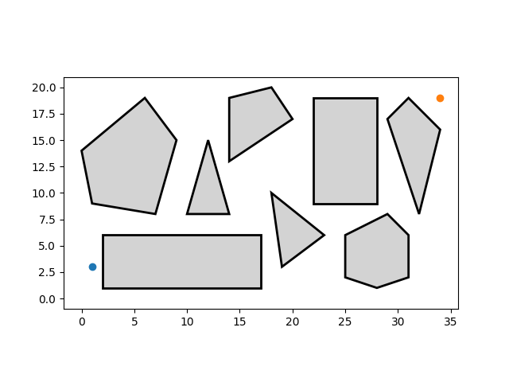
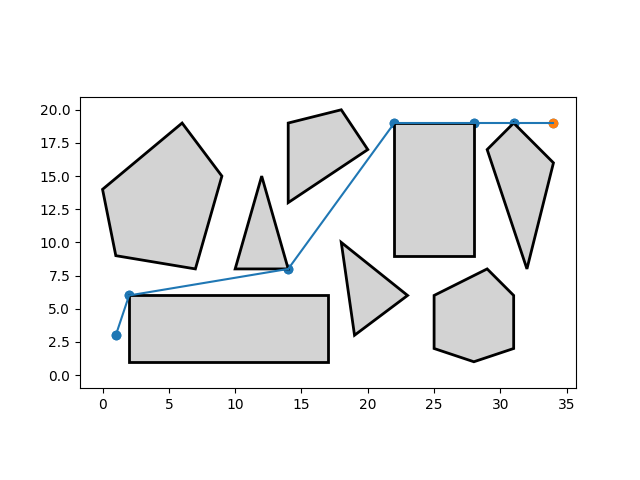

README

# Robot-guide
robot guide through a 2d map with polygon obstacles using searching algorithms

# Libraries installation
This program use  https://github.com/scikit-geometry/scikit-geometry available using this command:
`conda install scikit-geometry -c conda-forge`

# Test demo
I test si possono fare dalla classe main, un input richiederà quale mappa utilizzare (in questo caso ce ne sono 2), inserendo 0 si accede alla prima mappa, inserendo qualsiasi altro valore si accede alla seconda mappa. Scelta la mappa, il programma  mostrerà un plot(ad esempio):

In cui troviamo: lo stato di inizio(punto blu), lo stato di goal(punto giallo) e tutti i vari ostacoli presenti nella mappa(poligoni). Il programma chiederà poi quale algoritmo di ricerca usare: 1 - A* (graph)*, 2 - Uniform cost search (graph), 3 o qualsiasi altro numero - Breadth first search (graph). una volta scelto l'algoritmo,verrà eseguito e verrà mostrato un plot della mappa con il percorso trovato dall'algoritmo. Nel terminale verrà poi scritta la lista dei segmenti che compongono il cammino da inizio a goal e la sua lunghezza,
dopo aver eseguito per esempio A*:

# Codice di altre repository
Il codice del file utils.py, come il codice di astar e best first search è stato preso dalla repository https://github.com/aimacode.

*(graph): indica la versione usata dell'algoritmo. Questo utilizza una lista chiusa per memorizzare i nodi già esplorati in modo da non esplorarli di nuovo.
